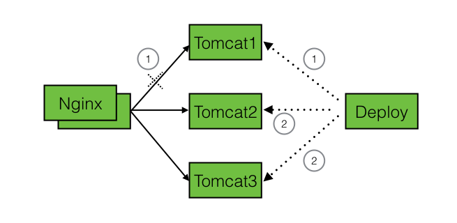

# auto
基于ansible的Java代码自动化部署

## 依赖

- [ansible](www.ansible.com)
- [nginx健康检测插件](https://github.com/yaoweibin/nginx_upstream_check_module)

## 拓扑

## 思路
1. 在Deploy拉取最新代码，打包
2. 切断nginx流量
3. 步骤2完成后，等待一段时间（有可能该tomcat还在执行任务），停Tomcat1
4. 拷贝代码、配置文件到Tomcat1
5. 起Tomcat1
6. 验证Tomcat1
7. 重复步骤3-6，分发到Tomcat2和Tomcat3

